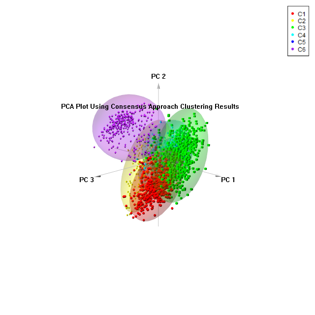

# R-Data-Visualisation

Visualising cancer data of immune subgroups.   

## Immune Subgroup Count

## Immune Subgroup Missing Data Summary

## Consensus Cluster Visualisation 

## PCA Cluster Visualisation

